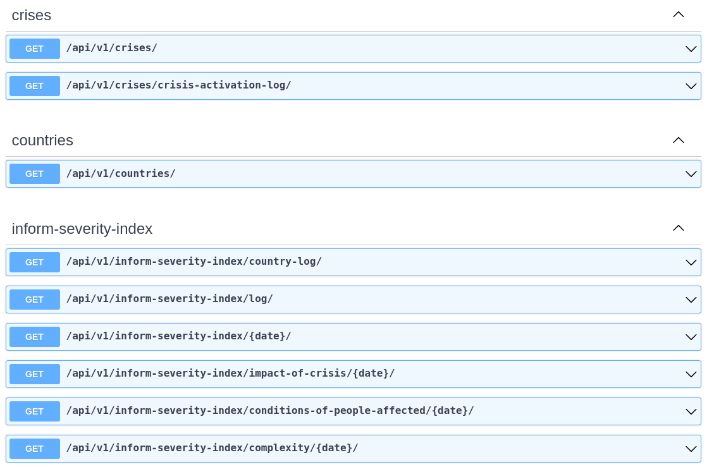

420 × 356

# What is ACAPS?

ACAPS is an independent organization that provides humanitarian data, analysis and capacity building to support the work of the humanitarian community. They services include global analysis, anticipatory analysis, and scenario-building, as well as analysis of specific crises in multiple countries. Their Analysis Hubs focus on specific contexts, such as Afghanistan, Colombia, and Ukraine. Their work aims to strengthen the evidence base for decision-making and response-programming among humanitarian stakeholders.

# What Data Does ACAPS Provide?

ACAPS provides and maintains [datasets](https://www.acaps.org/en/data) focused on specific crises (Afghanistan, Ukraine and Yemen) as well as analytical datasets on humanitarian access, risks and the INFORM Severity Index. All datasets come with comprehensive codebooks and/or methodology notes. You'll also find a very useful [Seasonal Calendar](https://www.acaps.org/en/thematics/all-topics/seasonal-calendar) with major seasonal hazards such as floods, droughts, cyclones, disease outbreaks, and crop pests, including locusts in addition to details about crops' growth cycles and lean seasons for the main crops cultivated in each country.

# How To Access The Data?

ACAPS data is available in 2 ways: direct download and via API.

## Direct Download

You can browse the [list of data sets](https://www.acaps.org/en/data). Once you select a dataset the side panel allows you to download it. You might want to set the appropriate the data range before downloading the data. It takes a seconds for the downloads to start since the data file is generated on the fly (for datasets with date range selection). The side panel is also where you will get access to the codebooks and methology notes.

You can find out more about how some of these datasets in the [Thematics section](https://www.acaps.org/en/thematics) of the ACAPS website.

## API

All the ACAPS datasets are accessible via API with apparently no usage limitations, although we do encourage you to be mindful since each API request has a cost for ACAPS. In order make requests to the API you will first need to:

1. Create an account on their dedicated [API site](https://api.acaps.org/)
2. Obtain your Authorization Token that will need to be provided with each request to authenticate you (see below)

The API site offers a [Swagger](https://swagger.io/) generated documentation that allows you to try out every single API endpoint. You can use /api/v1/auth-token/ endpoint to generate your Authorization Token. This can obviously be done problematically but since your token is unique for your account, you might as well do it here at once. All the details to use the API can be found [here](https://api.acaps.org/using-the-api/).

ACAPS also provides [working scripts](https://api.acaps.org/working-examples/) for Python and R to get you started in no time. If you are more of a Ruby person (as we are at Somari) [here](https://gist.github.com/gdeflaux/bffd5a7efb9a0c5d0e66025a7eeefa18) is the equivalent Ruby code. If you use any other language, just ask ChatGPT to convert the code to you preferred language.

# Further Reading

If you want to know more about how ACAPS creates these datasets, visit the [Metholodology section](https://www.acaps.org/en/methodology/) of the website. You will also find basic guides on [PowerBI](https://www.microsoft.com/en-us/power-platform/products/power-bi/) and [Tableau](https://www.tableau.com/).

A good example of ACAPS data in action is their [Countries page](https://www.acaps.org/en/countries) in which data from the Inform Severity Index and Risk Level are combined.

# Conclusion

ACAPS makes is very easy for anyone to get access and use their data. Give it a try and don't hesitate to [share with us](https://www.linkedin.com/company/somari-io/) how you are using it.
